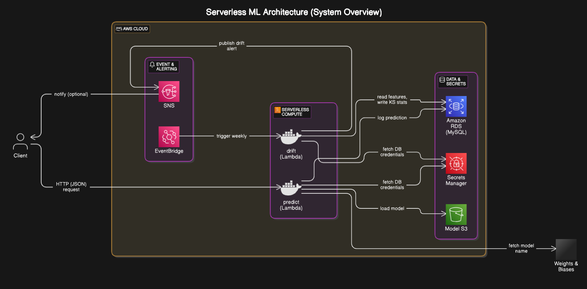

## 🧠 Project Overview

**Serverless ML** is a modular machine learning system deployed entirely on AWS using serverless technologies. It enables real-time prediction, automatic data logging, and periodic feature drift detection — all without managing servers.

The system is designed to demonstrate a practical, production-ready MLOps pipeline using AWS Lambda, RDS MySQL, EventBridge, Docker, and CDK. It is ideal for showcasing how to build and serve models in a lightweight, scalable way using only cloud-native tools.

### 🔄 How It Works

1. **Real-time Prediction**
   - A `predict` Lambda is deployed via Docker and exposed using a Lambda Function URL.
   - It accepts JSON input (`features`) and returns a model prediction.
   - The model is loaded from S3 (referenced by a WandB experiment).
   - Input features + predicted label are optionally logged to an RDS table.

2. **Data Storage**
   - Predictions and features are stored in a MySQL-compatible RDS instance.
   - The schema is defined manually via SQL files located in the `/sql` directory.

3. **Drift Detection**
   - A `drift` Lambda runs periodically (weekly) using EventBridge.
   - It queries recent rows from the feature table and compares them to earlier rows using the Kolmogorov–Smirnov test.
   - If any features drift significantly, an alert is published to an SNS topic.

4. **Infrastructure Management**
   - All resources (Lambdas, RDS, EventBridge rules, IAM roles) are deployed via AWS CDK in the `/infra` directory.
   - Dockerized Lambda functions are managed under `/lambda`.

---

### 📦 Key Components

| Component     | Technology          | Description                                         |
|---------------|---------------------|-----------------------------------------------------|
| Inference API | Lambda + Docker     | Serves a trained ML model behind a Function URL     |
| DB Storage    | Amazon RDS (MySQL)  | Stores input features and model predictions         |
| Drift Checker | Lambda + EventBridge| Scheduled weekly to run KS tests on feature drift   |
| Infra as Code | AWS CDK (TypeScript)| Manages all AWS resources using versioned code      |
| Experiment Tracking | Weights & Biases | Tracks model runs and selects the best for deploy |
