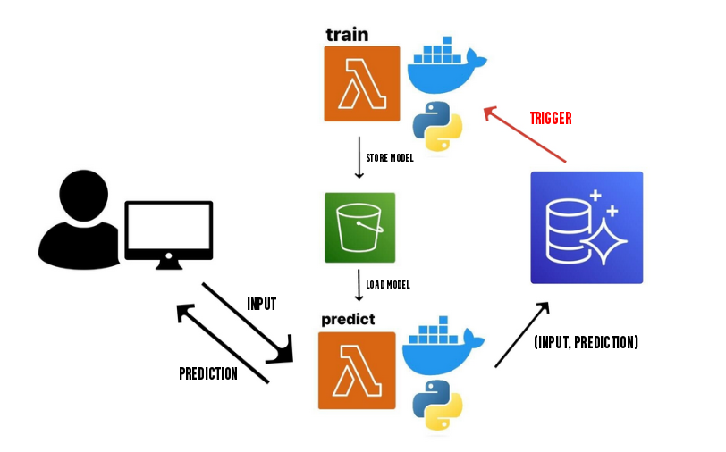

# Serverless MLOps System on AWS



## Overview

This project consists of two directories: database and ml-demo-api. The aim is to create and deploy an MLOps architecture that serves a model for mental health disorder prediction. The entire workflow consists of a 3 AWS Lambda functions and an AWS RDS MySQL database.

The architecture supports:
1) Training, logging and versioning the models.
2) Loading the best model and making predictions with it.
3) Storing each new input feature and model prediction.
4) Detecting data distribution drift and triggering model re-training.
5) Notification alerts about the training process.

## Architecture Components

### 1. AWS RDS MySQL Database

The database directory is a local environment for a developer to execute queries on the database. The SQL queries support table creation, table population, trigger and stored procedure creation. It also supports counting the insertion of new labeled features to the table. When 100 new labeled features are inserted, a stored procedure triggers a Lambda function for data distribution shift check and the counter is reset back to 0.

### 2. AWS Lambda Functions

I have deployed 3 Dockerized Python Lambda functions. I chose a Docker container so I can easily build the environment and install the neccesary dependencies.

1) Data distribution shift function - this function runs an algorithm which detects if the distribution of data points per categories has shifted. This means that the real-world distribution of data is actually different than the distribution my model approximated and model re-training with newly stored data is needed.
2) Train function - loads the features from the feature table, trains the model and logs the training metrics on Weight&Biases platform.
3) Predict function - This function takes user input from the body of an HTTP POST request, loads the champion model, returns a prediction to the user, transforms the input data and label and stores them as a new labeled feature to the feature table.

### 3. AWS S3 Bucket

The bucket serves as a model storage where the train Lambda function saves the model, and the predict Lambda function loads the model from.

### 4. Weight&Biases Model Tracking

Tracks model metadata, model storage paths and the training process and evaluation metrics. Used for selecting the model which showed the best performance metrics during evaluation.

## Deployment
Deploy dockerized :whale: Lambda functions for prediction and training:

```npm install -g aws-cdk```

```cdk bootstrap --region [REGION]```

```cdk deploy```

## License

This project is licensed under the MIT License - see the [LICENSE](LICENSE) file for details.
